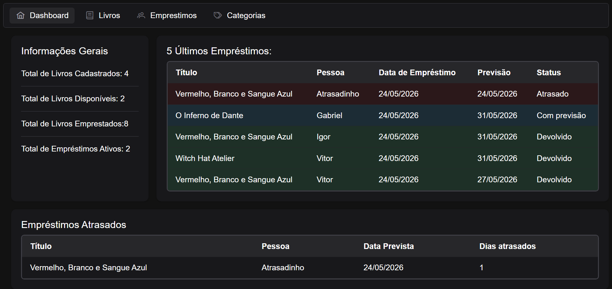
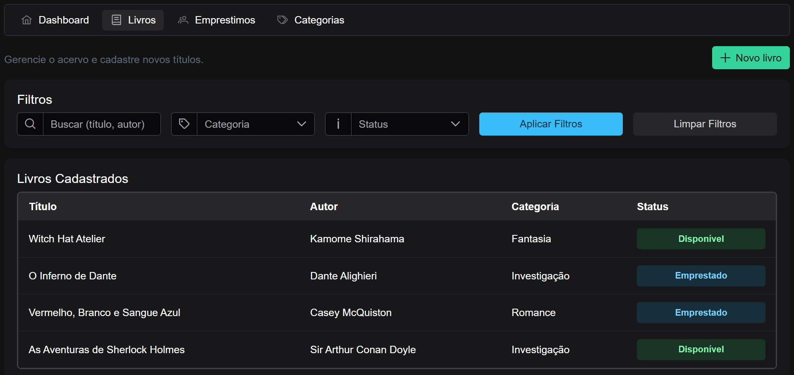
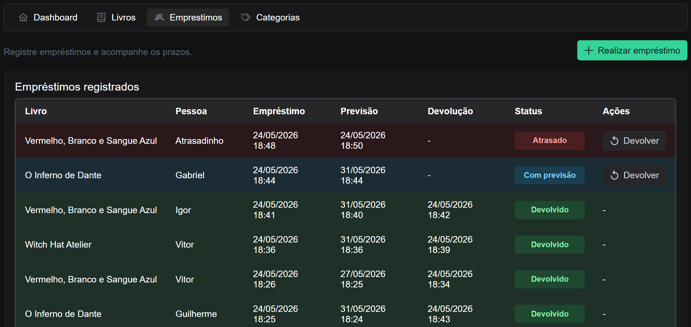
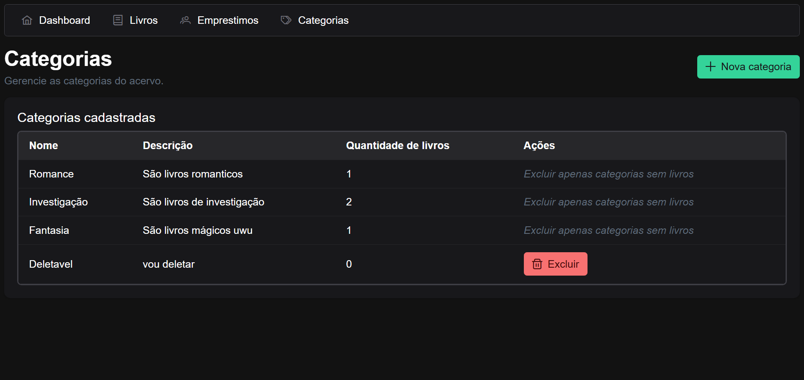

# Minha Biblioteca
[](https://github.com/GuiSaiUwU/Minha-Biblioteca/actions/workflows/ci.yml)

Projeto simples de gerenciamento de uma biblioteca com backend em Java (Spring) e frontend em Angular.

Visão geral
- Backend: APIs REST para categorias, livros e empréstimos.
- Frontend: SPA (Single Page Application) em Angular com telas de listagem, cadastro e dashboard.

Como rodar
- Backend: [Como Executar](#como-executar-windows)
- Frontend: [Como Executar](#como-executar)

Screenshots

Dashboard


Livros (menu)


Empréstimos (menu)


Categorias (menu)



## 🌐 Backend (`recipebook-backend`):
### 🛠️ Tecnologias Utilizadas
- **Java 17** - Linguagem de programação
- **Maven** - Gerenciador de dependências e build
- **H2 Database** - Banco de dados owo
- **Spring Boot 3.5.x | JPA | WEB | Validation**

### Como executar (Windows)
- Certifique-se que o JAVA_HOME existe como variável de ambiente (Java 17+)
```powershell
$env:JAVA_HOME = 'C:\Caminho\Do\Java\...\jdk-17'
```

1. Abra o terminal na raiz do projeto
1. Entre na pasta do backend (`cd .\biblioteca-backend`).
1. Rode o comando abaixo para executar a aplicação da API:
   ```powershell
   .\mvnw clean compile spring-boot:run
   ```
1. A API ficará disponível em `http://localhost:8080`

### Compilar via IDE
- Abra o projeto em sua IDE (IntelliJ IDEA, Eclipse, VS Code + extensões)
- Clique em "Run" ou execute a classe `ApiApplication.java`

## 🪟 Frontend (`biblioteca-frontend`): 
### 🛠️ Tecnologias Utilizadas
- **Angular** - Framework para construção de SPA (Single Page Application)
- **PrimeNG** - Estilização de componentes, icones e temas
- **Typescript** - Javascript só que bom(?)

### Como executar
1. Abra o terminal na raiz do projeto
1. Entre na pasta do frontend (`cd .\biblioteca-frontend`).
1. Instale as dependências (`npm install`). 
1. Rode o comando abaixo para executar a aplicação web:
   ```powershell
   ng serve
   ```
1. O website ficará disponível em `http://localhost:4200`